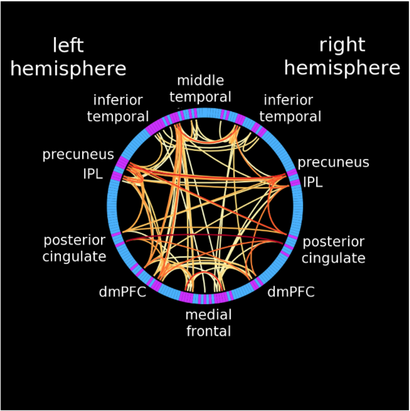

# Welcome to 38612 #
## Information Visualization for Data Scientists ##

## Instructor: ##
Joel Welling
welling@psc.edu

Office hours are by appointment for now, by Zoom or in person (here in 300 SC room 315).

## Equipment ##
Do you have a laptop or equivalent?
* Linux?
* Windows?
* Mac?

Can you write code on it?

Any assignment I give *can* be done on your Bridges2 accounts, but
it's entirely appropriate (and maybe easier) to do it on your laptop.

## Reality Checks ##
I'm assuming that:
* Everyone can write and run Python 3
* Everyone can fire up a Jupyter Notebook, and modify it if
necessary.
* Everyone can run a Python program *outside* a Jupiter
Notebook, like on a command line.
* Everyone can edit files.

If you are not comfortable doing any of these things, contact me after
class and we will fix it.

## Other Experience ##

What kinds of data visualization have you done in the past?

What kinds have you seen elsewhere that you were impressed by?

## Data, Idioms, and Manifolds ##

Visualization techniques mostly consist of collections of *idioms* for
mapping data to visual representations.

Any given visualization is built by combining idioms.

Idioms are only applicable to data of particular types.  For example,
a spreadsheet and a fluid dynamics simulation require very different
idioms.  Data exists on *manifolds*, and each idiom is only suitable
for one or a few different manifolds.

## Getting The Data Into The User's Brain ##

Obviously, the best choice of visualization depends on the view.
Consider color-blind viewers, for example.

Experience also matters.  Almost everyone can read a bar chart, but
highly skilled users can become proficient with some very complex
idioms.

Brain connectivity, from LaPlante et al. 2014, "The ConnectomeVisualization 
Utility: Software for Visualization of Human Brain Networks"

