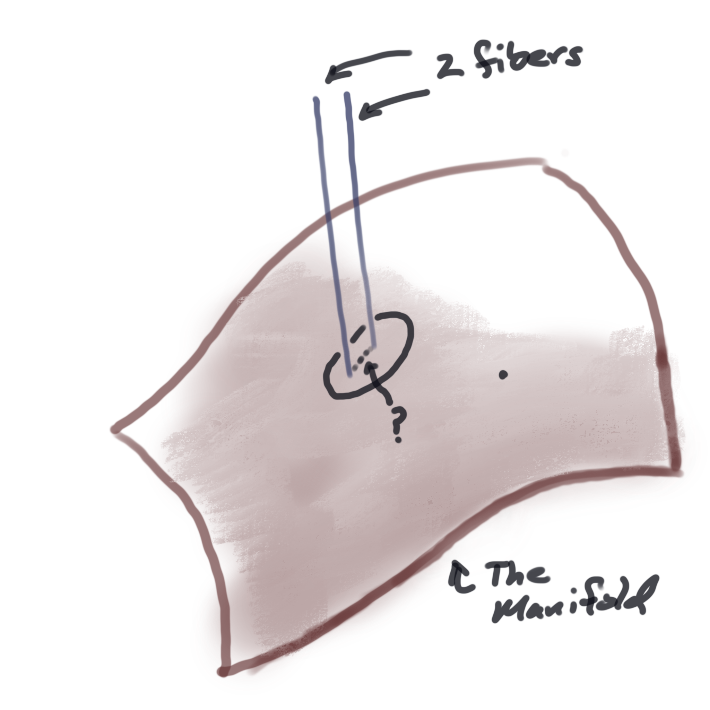

## Data Lives On Manifolds

Why do we care?  Because visualization uses *idioms* and the choice of
idiom depends on the type of data.

This Idea Comes From Fiber Bundle Theory

The **Manifold** is the space within which the data exists.
* It might be 2D, like a map
* It might be 3D, like some physical space
* It might be 0D, like entries in a spreadsheet

The **Fiber** is the data.
* It might be a simple scalar, like depth of snow or the density of
Colin's head.
* It might be a vector, like a velocity.
* It might be a collection of scalars, like the columns of a spreadsheet row

But Are The Fiber Values Continuous?

The values on the fibers may very continuously, or they may not.
* Snow depth would be a simple continuous scalar
* The name of a county on a map is not continuous, and can't be interpolated.

## Manifolds and Fibers Restrict The Idiom
A particular visual idiom is applicable to a particular type of fiber on a particular type of manifold.

We'll use this to lend some order to the zoo of idioms we're considering.

## Some familiar idioms

 

The manifold is discontinuous, like a spreadsheet.  Each fiber has multiple
scalar values, which get stacked.  These scalars have error bars.

 

This manifold is 1D continuous.  The fibers contain 3 scalars, which
we treat as continuous real values.

 

This is a 2D continuous manifold.  Each fiber contains a single real-valued
scalar. We can take derivatives in either direction.

 

Same as the previous example.  This is a different idiom for the same types
of manifold and fiber.

## Combinations of idioms build complexity

 

The manifold is 1D, continuous time.  The scalars are statistical quantities.
We use three curves per scalar to show how the median and IQR vary over time.

At each time point we have a collection of statistical samples.  By reducing
the distribution at each time to a summary (Q1, median, Q3) we can map it to
a known idiom for multiple simple scalars on a 1D manifold.

