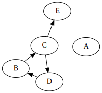
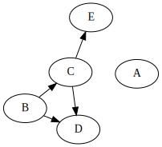

## Graphs - The kind with Nodes and Edges ##

Graphs are ubiquitous in computational work and data science.

I have used graphs for:
* software component descriptions
* analysis workflow descriptions
* patient flow
* transport and logistics
* describing the logistics and provenance of datasets
* constructing an ontology

You too will need to draw complex graphs.

### Types of graphs

A *graph* is any collection of nodes and edges.  Not all nodes must
have edges, but every edge must connect two nodes. 

In a *directed graph* or *digraph*, every edge has a beginning and an end. 

An *acyclic graph* has no closed loops.  We can make the last graph
acyclic by reversing one edge. 

A *tree* always branches out, so that every node has at most one
incoming edge.  One node has zero incoming edges- it is the root of
the tree. 

The mathematics of graphs is beautiful and fascinating.  We could talk
about graph centrality and connectedness for an entire course.

But that would not be this course.

### Layout methods

Graph layout is a tricky business, because the display area is 2D.  How to
minimize overlap and crossing of graph edges?

We will be working with [Graphviz](https://graphviz.org/) , an old but
very stable and capable *non-interactive* package.  Because it can
produce such lovely graphs and has a wide selection of *layout engines*,
a lot of the static graphs you see on the web were made with Graphviz.

Interactive tools exist, in the form of javascript libraries.  Operation is
very much like D3, which we will cover soon.

Interactive layout is generally force-directed.

Let's look at a tiny bit of the provenance graph of the HuBMAP project,
in the web interface to the Neo4J Graph Database.

Graphical elements are made to repel eachother, in this case via
javascript interactions.  Note that you may still have to rearrange
elements to get a clear view.

Other interactive layout methods exist, for example grid-based layout.
If the graph is actually a tree, layout becomes a lot simpler.

