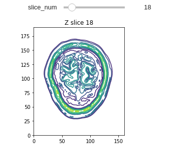

## Widgets For iPython Notebooks ##

This class is about visualization, and interactivity is a key
component of visualization.

We can get a start on this by adding interactive widgets to our notebooks.
We'll use Jupyter Widgets, aka ipywidgets.


## Remember how this works:

The browser is speaking HTML with the Server (probably running in
another window on your laptop)


Python code is executing in the Kernel, under control of the Server.

That code sends stuff to the Server to pass along to the Browser.


So, widgets should be the Server's job. The Kernel would normally just run python commands when you hit 'run'.

How are widgets in the kernel even possible?


The widget code runs _asynchronously_ in the kernel, and sends HTML
and CSS to the browser.  

The server just passes things through.


We can explicitly control this asynchronous operation, but mostly the
widget toolkit will handle that for us.


## Setting Things Up

See [Jupyter Widgets documents](https://ipywidgets.readthedocs.io/en/latest/), especially the sections on *Installation* and *Simple Widget Introduction*.

```
pip install ipywidgets
```

or alternately,

```
conda install -c conda-forge ipywidgets
```


## Let's Use Colin's Brain

For this exercise, let's use the [Colin27 MRI Dataset](https://www.statnews.com/2017/08/02/colin-holmes-famous-brain-science/).  It's available in raw form [here](https://www.bic.mni.mcgill.ca/ServicesAtlases/Colin27).

A handy version, already converted to brick-of-bytes format, is on the
class web page in the data directory.


Assuming you've cloned the class Github repo, it's easy to get Colin27
in numpy form:
```
file_path = '/home/welling/git/CMU-MS-DAS-Vis-S22/data/colin27_tlrc_161_191_151.bytes'
colin_tlrc = np.fromfile(file_path, dtype=np.uint8)
colin_tlrc = np.reshape(colin_tlrc, (161, 191, 151), order='F')
```
Obviously you need to customize file_path.

np.uint8 says that the data is in bytes.

The data dimensions are those of the [ICBM (International Consortium
for Brain Mapping) coordinate system](http://www.bmap.ucla.edu/portfolio/atlases/ICBM_Template/).  The byte order is (F)ortran,
meaning left-index-fastest.


## A Quick Interactive Display

We'll do this interactively in a Jupyterlab environment, but here are
the important bits.


It's easy to make a quick contour plot of the brain using matplotlib:
```
x = np.arange(0.0, colin_tlrc.shape[0], 1)
y = np.arange(0.0, colin_tlrc.shape[1], 1)
X, Y = np.meshgrid(x, y, indexing='ij')
fig, ax = plt.subplots()
countours = ax.contour(X, Y, colin_tlrc[:,:,50])
```

We are looking at a single slice in Z.

X and Y are meshgrids providing the x and y coordinates to ax.contour .


But we need to fix the aspect ratio.  We want the pixels to be square.
```
def draw_slice(slice_num):
    fig, ax = plt.subplots()
    contours = ax.contour(X, Y, colin_tlrc[:,:,slice_num])
    ax.set_title(f'slice {slice_num}')
    # set the aspect ratio
    ratio = colin_tlrc.shape[1]/colin_tlrc.shape[0]
    x_left, x_right = ax.get_xlim()
    y_low, y_high = ax.get_ylim()
    ax.set_aspect(abs((x_right - x_left)/(y_low - y_high))*ratio)
draw_slice(50)
```

And we wrapped it in a function for convenience.


Let's make a _closure_ to allow setting the data volume at run time.
```
def create_draw_slice(vol):
    x = np.arange(0.0, vol.shape[0], 1)
    y = np.arange(0.0, vol.shape[1], 1)
    X, Y = np.meshgrid(x, y, indexing='ij')
    def func(slice_num):
        fig, ax = plt.subplots()
        ax.set_title(f"Z slice {slice_num}")
        contours = ax.contour(X, Y, vol[:,:, slice_num])
        # set the aspect ratio
        ratio = vol.shape[1]/vol.shape[0]
        x_left, x_right = ax.get_xlim()
        y_low, y_high = ax.get_ylim()
        ax.set_aspect(abs((x_right - x_left)/(y_low - y_high))*ratio)
    return func
thing = create_draw_slice(colin_tlrc)
thing(20)
```
The function is "closed over" the volume we choose (colin_tlrc in this case).


A more clever version can take the slicing axis as input as well...
```
def create_draw_slice(vol, axis=2):
    assert axis in [0, 1, 2]
    idx0, idx1 = [(1, 2), (2, 0), (0, 1)][axis]
    x = np.arange(0.0, vol.shape[idx0], 1)
    y = np.arange(0.0, vol.shape[idx1], 1)
    X, Y = np.meshgrid(x, y, indexing='ij')
    def func(slice_num):
        ...more code goes here...
    return func
```
but that gets too long to fit on a slide.  See the example notebook.


This is a good time to think about **keeping your coordinate systems
oriented**.  It's easy to tell the top of the head from the bottom, but
what about left/right?  Flipping left for right with actual data is a
_really grave error_.


## Now Let ipywidgets Do It's Magic

```
draw_slice_z = create_draw_slice(colin_tlrc, 2)
widgets.interact(draw_slice_z,
                 slice_num = widgets.IntSlider(value=50,
		                               min=0,
					       max=colin_tlrc.shape[2]-1))
```
