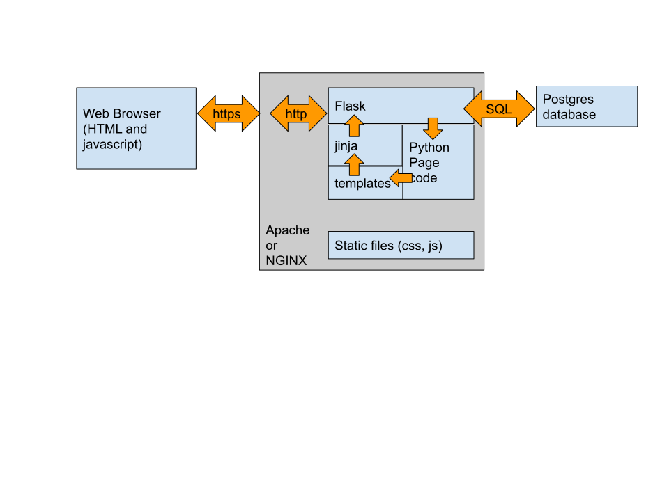

## Now We Need A Web Server ##

In class, most visualization (and practically everything else!) takes
place in Jupyter Notebooks.

In the real world, most visualization (and practically everything else) takes
place in a web browser.

We've reached the point where we need to look at tools beyond Jupyter.


Please note that you are not expected to fully understand this web server.
This is a visualization course, not a full stack web infrastructure course!
So don't worry, and just try to understand what information is going where.

The goal is to learn to produce a visualization that will be served by a
web server, not to be able to produce the web server itself.


## What We Will Set Up

We are going to start a program on our local machines that runs outside of a
notebook, and that responds to requests sent via http by sending web pages
with visualizations on them.


This is only a subset of how a real web server works, but it is enough to
try out some tools.  Also, it's important to know what is really happening
behind the scenes in any real modern application.


There is no magic, no Cloud, no such thing as a "web site"- only other
people's computers, running code like your code.


## Flask

We will use a very lightweight web infrastructure tool called
[Flask](https://flask.palletsprojects.com/en/2.0.x/) .  Larger tools with
greater functionality are available (for example
[Django](https://www.djangoproject.com/)), but for now, simplicity is best.

Note that Jupyter Notebook is itself a web server, but is not flexible enough
for what we need now.


Please clone and install this repo:
[https://github.com/jswelling/CMU-MS-DAS-Vis-Flask](https://github.com/jswelling/CMU-MS-DAS-Vis-Flask) . Please create a git branch, with your name in the
branch name.


If you give me your github ID, I'll make you a contributor on the
repo so you can push updates to your branch.

Please don't push new code to the master branch of the repo.


## What We Have

The application follows this [Flask Tutorial](https://flask.palletsprojects.com/en/2.0.x/tutorial/) very closely, except that:
* We are only creating the index page and the necessary code to
  define the user.  Thus all reference to blog posts has been
  stripped out.
* The name of the app has changed from **Flaskr** to **MyProj**.
* There are no more blog posts, so the index page is now provided
  by *main.py* and *index.html*


You are running the server on your own local machine, and it should
not be visible from any other machine.  It is in developer mode and
has almost no security.  **Never run this server in public unless you
have fixed the security issues.**


Unfortunately the details of the security issues are beyond the scope
of this course.  Having a real SECRET_KEY and guarding against false
inputs the starting points.  Flask has tools that can help.


## Let's spend a few minutes exploring the app.

The stuff in ```{{ }}``` and `````` is
[jinja templating](https://jinja.palletsprojects.com/en/3.0.x/).  Remember
that it is evaluated *at the server*, using information provided in
the ```render_template()``` call.

You can see the rendered version in the Developer Tools source view.  By the
time it reaches the web browser, it has been converted to standard HTML.


It is jinja templating that lets us implement a 'standard' page using the
*base.html* template.  This functionality is very flexible and could be
expanded *a lot*, but for now let's keep it fairly simple.


The stuff in the ```<script>...</script>``` blocks is javascript.  We use
one standard javascript library, [jQuery](https://jquery.com/) , for
convenience.  There is also some custom javascript to handle some individual
pages.

The trick to remember about jQuery is that we can use the expression
```
$("#somename")
```
to find and access an HTML element with the id string "somename".


Javascript code actually executes in the browser, and controls all behavior
beyond just displaying standard HTML.  For example, it is javascript code
that allows us to use the
[AJAX operation](https://www.w3schools.com/whatis/whatis_ajax.asp)
that generates the matplotlib plot.


## What A Real Web Site Would Need
 



We would need a real web server, because Flask alone is too slow for
real traffic.  Flask can then run in a Python environment within that
webserver.
* [Apache](https://httpd.apache.org/)
* [NGINX](https://docs.nginx.com/nginx/admin-guide/installing-nginx/installing-nginx-open-source/)


We would need https support.  A real web server would provide that,
and automatically translate to the http which our server speaks.


We would need a real database. We have a tiny one based on Sqlite, but
for a serious project we would want a full-sized SQL database like:
* [MySQL](https://www.mysql.com/)
* [PostgreSQL](https://www.postgresql.org/)


We would need session management.  There is really no state to the
sessions we have now.  The visualization is completely recreated every
time we click 'Submit'.  A real session would allow things to be
remembered between page views.  Flask has plug-ins for that.


We would need better login management.  Users should provide email
addresses and those should be verified, for example.  Flask has plug-ins
for that too.


## In-Class Exercises

Change the code so that the Selector can control the line style- a line,
points only, or the line plus points.

Add a checkbox to control the presence of a legend.

Change the checkbox that controls the presence of the upper axis lines
to a pair of radio buttons instead.